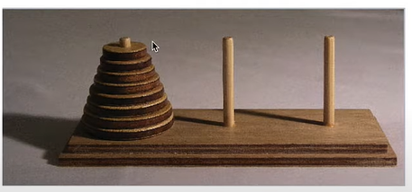
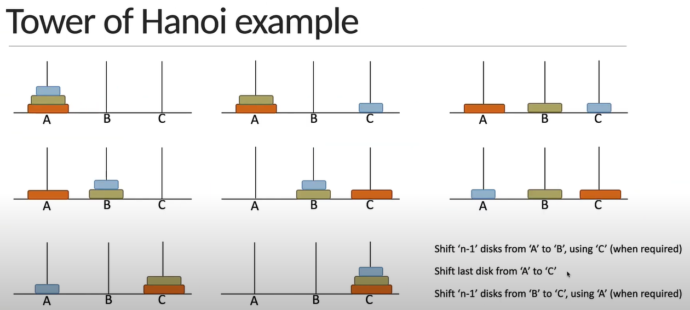

# Misc Alogrithms
- Cartesian product (of two sets) 
- Climbing staircase - good for interviews
- Tower of Hanoi
- Many others

## Cartesian product
Time complexity - O(n * m)

Cartesian Products of two finite non-empty sets A and B, denoted as AxB, is the set of all ordered pairs (a,b) where a is from set A and b is from set B.

const A = [1,2]
const B = [3,4]
AxB = [[1,3],[1,4],[2,3],[2,4]]

Idea
Traverse each array and pair each element in the first array with each element in the second array

## Climbing staircase
Good interview problem

Idea
If you have to climb to the step n, you can climb to the n-th step from the (n - 1)-th step or (n - 2)-th step. We know that if only one step is possible, there will always be only a single possible way (1). If there are two steps possible we can go like this (1,1) or (2).

Another way is to use recursion BUT it is very inefficient! Even n = 100 will take a long time to compute.
- Sum of climbingStaircase(n-1) and climbingStaircase(n-2)

## Tower of Hanoi
Explains how recursion can simplify the solution to a problem

### Explanation of the puzzle
Math problem where you have three rods and discs of various diameters.

The objective is to move the entire stack to the last rod, obeying the following rules:
- Only one disk may be moved at a time
- Each move consists of taking the upper disk from one of the stacks and placing it on top of another stack or an empty rod
- No disk may be placed on top of a disk that is smaller

- There are four variables - disk no., fromRod, toRod, auxRod
1. n-1 disks from A to B, using C (recusively moved disks from A to B, change the final destination on each recursion - B or C)
2. last disk from A to C (base case, if n === 1, move it)
3. n-1 disks from B to C, using A (recursively moved disks from B to C, change the final destination on each recursion - C or A)