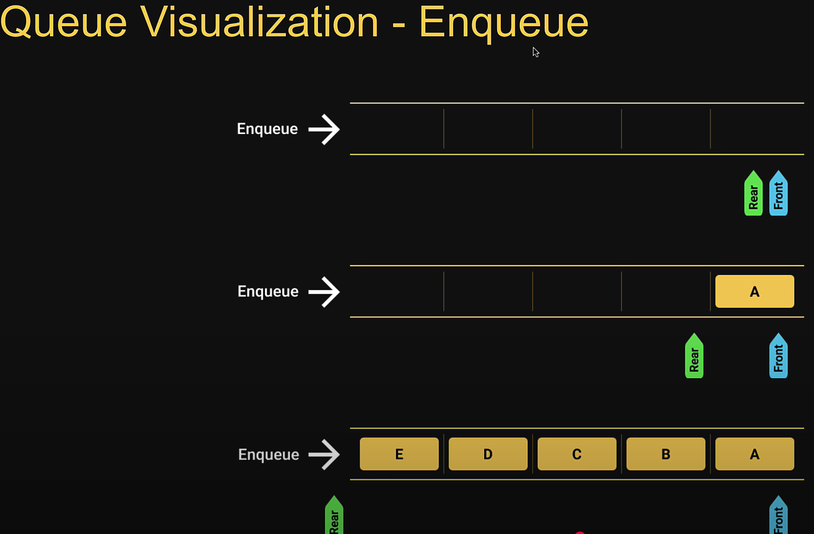
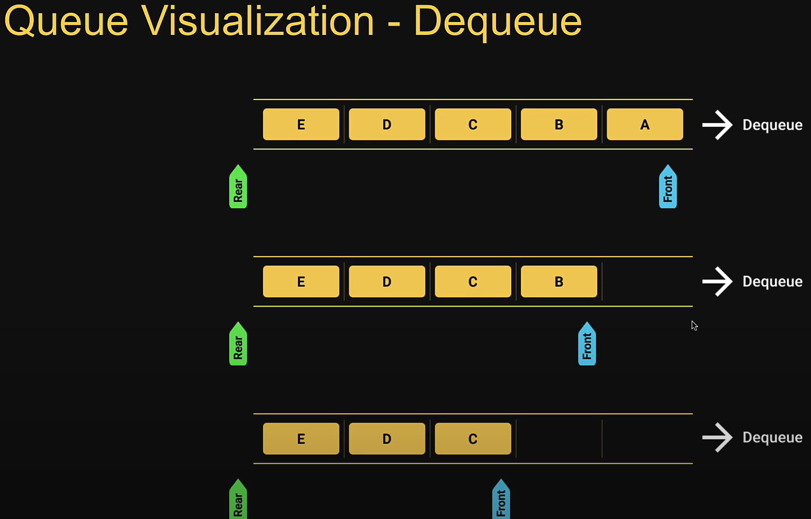

# Custom data structures
Custom DS are more complex DS but often used that are built using the built-in DS

## Stack
The stack DS is a sequential collection of elements that follows the principle of Last In First Out (LIFO).

The last element inserted onto the stack is the first element to be removed.

Analogy: Stack of plates. The last plate placed on top of the stack is also the first plate removed from the stack.

Stack is an abstract data type. It is defined by its behavior rather than being a mathematical model. -> Stack is a simple list (array or object) but is defined by its behavior

Supports two main operations:
- Push - adds an element to the collection
- Pop - removes the last element from the collection

Stack Usage

Useful when you want to trace back your steps. E.g. Browser history tracking, Undo operation when typing, Expression conversions, Call stack in JS runtime

## Queue
The queue DS is a sequential collection of elements that follows the principle of First In First Oout (FIFO).

The first element inserted into the queue is the first element to be removed.

Analogy: A queue of people. People enter the queue at one end (rear/tail) and leave the queue from the other end (front/head)

Queue is an abstract data type. It is defined by its behavior rather than being a mathematical model. -> Queue is a simple list (array) but is defined by its behavior

Supports two main operations:
- Enqueue - adds an element to the rear/tail of the collection
- Dequeue - removes an element from the front/head of the collection

Queue Usage

Useful when you want to process things in orderly fashion. E.g. Printers, CPU task scheduling, Callback queue in JS runtime

## Circular Queue
Extended version of a regular queue

The size of the queue is fixed and a single block of memory is used as if the first element is connected to the last element.

Also referred to as circular buffer or ring buffer and follows the FIFO principle.

A circular queue will reuse the empty block created during the dequeue operation.

When working with queues of fixed maximum size, a circular queue is a great implementation choice.

The circular queue DS support two main operations:
- Enqueue - adds an element to the rear/tail of the collection
- Dequeue - removes an element from the front/head of the collection

If the queue is full (the buffer is full), you cannot enqueue any more.

Circular Queue Usage

Whenever you have a queue of a fixed size. E.g. Clock, Streaming data (buffer), Traffic lights

## Linked List
A linked list is a linear DS that includes a series of connected nodes

Each node consists of a data value and a pointer that points to the next node. -> So the order of nodes is not given by their physical placement in the memory

Advantage of the linked list over conventional array is that the list elements can be easily inserted or removed without reallocation or reorganization of the entire structure. -> This is because the nodes doesn't need to be stored subsequently in the memory

The drawback is that random access of elements is not feasible and accessing an element has a linear time complexity. -> because it needs to go from one node to another

The linked list DS supports three main operations:
- Insertion - add an element at the beginning, end or at a given index in the list
- Deletion - delete an element given its index or value
- Search - find an element given its value

Linked List Usage

Used to implement stacks and queues. All applications of both stacks and queues are applications of linked lists. Example: Image viewer - looking at photos continuously in a slide show.

Favored at interviews

Types of Linked Lists:
- Singly Linked Lists - first node has a pointer to the following node (next), last node references nothing

- Doubly Linked Lists - each node has to pointers - to the previous node (previous) and the following node (next). This makes insertion and removal at both ends possible in constant time complexity at the expense of more space.
