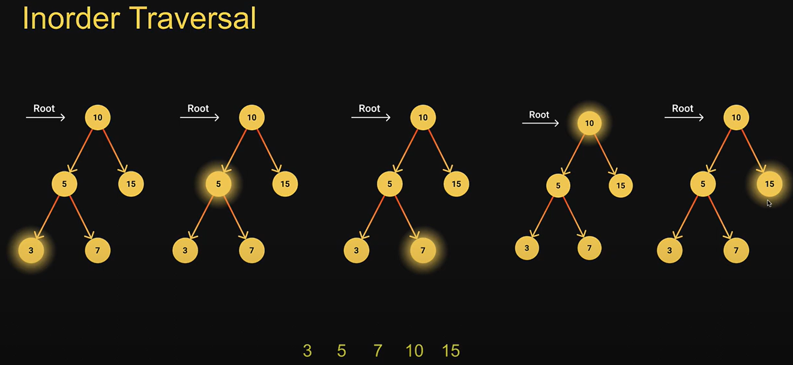
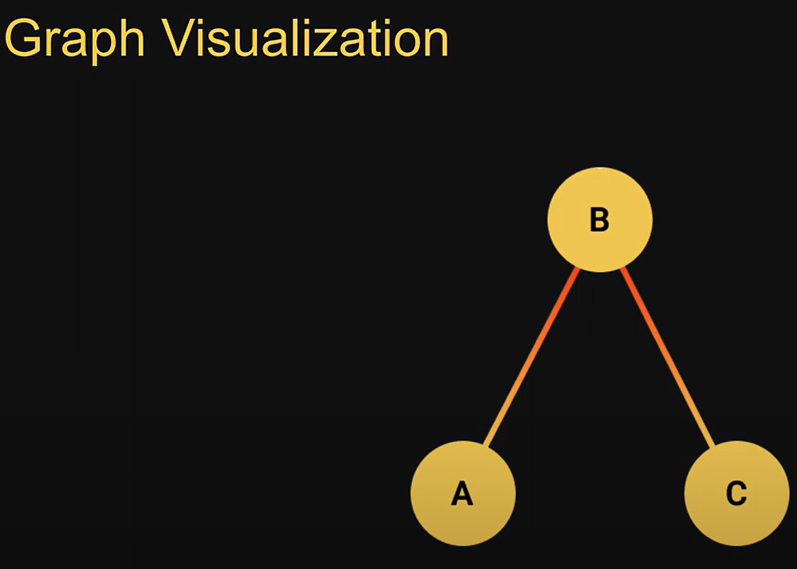

# Custom data structures
Custom DS are more complex DS but often used that are built using the built-in DS

## Stack
The stack DS is a sequential collection of elements that follows the principle of Last In First Out (LIFO).

The last element inserted onto the stack is the first element to be removed.

Analogy: Stack of plates. The last plate placed on top of the stack is also the first plate removed from the stack.

Stack is an abstract data type. It is defined by its behavior rather than being a mathematical model. -> Stack is a simple list (array or object) but is defined by its behavior

Supports two main operations:
- Push - adds an element to the collection
- Pop - removes the last element from the collection

Stack Usage

Useful when you want to trace back your steps. E.g. Browser history tracking, Undo operation when typing, Expression conversions, Call stack in JS runtime

## Queue
The queue DS is a sequential collection of elements that follows the principle of First In First Oout (FIFO).

The first element inserted into the queue is the first element to be removed.

Analogy: A queue of people. People enter the queue at one end (rear/tail) and leave the queue from the other end (front/head)

Queue is an abstract data type. It is defined by its behavior rather than being a mathematical model. -> Queue is a simple list (array) but is defined by its behavior

Supports two main operations:
- Enqueue - adds an element to the rear/tail of the collection
- Dequeue - removes an element from the front/head of the collection

Queue Usage

Useful when you want to process things in orderly fashion. E.g. Printers, CPU task scheduling, Callback queue in JS runtime

## Circular Queue
Extended version of a regular queue

The size of the queue is fixed and a single block of memory is used as if the first element is connected to the last element.

Also referred to as circular buffer or ring buffer and follows the FIFO principle.

A circular queue will reuse the empty block created during the dequeue operation.

When working with queues of fixed maximum size, a circular queue is a great implementation choice.

The circular queue DS support two main operations:
- Enqueue - adds an element to the rear/tail of the collection
- Dequeue - removes an element from the front/head of the collection

If the queue is full (the buffer is full), you cannot enqueue any more.

Circular Queue Usage

Whenever you have a queue of a fixed size. E.g. Clock, Streaming data (buffer), Traffic lights

## Linked List
A linked list is a linear DS that includes a series of connected nodes

Each node consists of a data value and a pointer that points to the next node. -> So the order of nodes is not given by their physical placement in the memory

Advantage of the linked list over conventional array is that the list elements can be easily inserted or removed without reallocation or reorganization of the entire structure. -> This is because the nodes doesn't need to be stored subsequently in the memory

The drawback is that random access of elements is not feasible and accessing an element has a linear time complexity. -> because it needs to go from one node to another

The linked list DS supports three main operations:
- Insertion - add an element at the beginning, end or at a given index in the list
- Deletion - delete an element given its index or value
- Search - find an element given its value

Linked List Usage

Used to implement stacks and queues. All applications of both stacks and queues are applications of linked lists. Example: Image viewer - looking at photos continuously in a slide show.

Favored at interviews

Types of Linked Lists:
- Singly Linked Lists - first node has a pointer to the following node (next), last node references nothing

- Doubly Linked Lists - each node has to pointers - to the previous node (previous) and the following node (next). This makes insertion and removal at both ends possible in constant time complexity at the expense of more space.

## Hash Table
A hash table, also know as hash map, is a DS that is used to store key-value pairs

Given a key, you can associate a value with that key for a very fast lookup

Javascript's Object is a special implementation of the hash table data structure. However, Object class adds its own keys. Keys that you input may conflict and overwrite the inherited default properties. --> That's why we use the Map data structure.

Maps which were introduced in 2015 allow you to store key-value pairs.

In regular code, you should always utilize the Map data structure. Writing your own hash table implementation is a very popular interview question.

We store the key-value pairs in an array of a fixed size.

Objects have a string index and arrays have a numeric index. How do we go from a string to a number? The answer is a hash function.

A hashing function accepts the string key, converts it into a hash code using a defined logic and then maps it into a numeric index that is within the bounds of the array.

Using the index, store the value

The same hashing function is reused to retrieve the value given by a key.

The hash table DS supports three main operations:
- set - to store a key-value pair
- get - to retrieve a value given its key
- remove - to delete a key-value pair

Hash Table Usage

Hash tables are typically implemented where constant type lookup and insertion are required. E.g. Database indexing, Caches

Collisions

A simple hash function may cause collisions because it will generate the same index for different keys. 

A more complex hash function reduces collisions to a great extend. 

An increase of array size is NOT a preferred solution. Yes, you lower the chance of collision but it there is always a possibility of a data loss. Typically, when the hash table reaches half the capacity or more, the array capacity is doubled and the key value pairs are rehashed.

Time complexity
You may notice that get, set, and remove methods are all using the find method. For this reason, the Big O time complexity should be linear O(n), however, the arrays over which these methods iterate should be very small with a solid hash function (because it reduces number of collisions). Hence, we typically talk about the average time complexity which is constant O(1).

## Tree
A tree is a hierarchical data structure that consists of nodes connected by edges. Typically each node stores a data value.

A tree is a non-linear data structure, compared to arrays, linked lists, stacks, queues which are linear data structures.

In linear data structures, the time required to search is proportional to the size of the data set. More the data, more time needed to search.

Trees however, owing to the nonlinear nature allow quicker and easier access to the data.

A tree will not contain any loops or cycles.

Tree Usage

Trees find usage in a number of scenarios where hierarchical representation is necessary. E.g. File systems for directory structure, a family tree, an organization tree, DOM, Chat bots, Abstract syntax trees.

Like linked lists, often asked during interviews.

Tree Terminology

- Parent node - immediate predecesor of any node
- Child node - immediate successor of any node
- Root - node from which the tree originates (it does not have a parent node)
- Leaf - nodes which don't have any child nodes (E, F, C, D)
- Siblings - nodes with the same parent ((B, C, D), (E, F))
- Ancestor - parent of a parent node (A is an ancestor E or F)
- Path - sequence of nodes and edges from one node to another, Path(A,E)=A-B-E
- Distance - number of edges along the shortest path between two nodes, Dist(A,E)=2
- Degree (of a node) - total number of childrens the node has, Degree(B)=2
- Degree (of a tree) - the maximum degree of a node in the tree, Degree(tree)=3 (because of node A)
- Depth (of a node) - number of edges from root to that node, Depth(E)=2, Depth(A)=0
- Height (of a node) - number of edges from the deepest leaf to the node, Height(B)=1
- Height (of a tree) - number of edges from the deepest leaf to the root, Height(tree)=2 

Binary Tree

A binary tree is a tree data structure in which each node has at most two children

They are referred to as left child and right child

Binary Search Tree

A binary search tree is a binary tree which has these two properties:
- the value of each left node must be smaller than the parent node
- the value of each right node must be greater than the parent node

BST support these operations:
- Insert - to add a node to the tree
- Search - to find a node given its value
- Travers - DFS (Depth First Search) and BFS (Breath First Search) - to visit all nodes in the tree
- Delete - to remove a node given its value

BST Usage
- searching
- sorting
- to implement abstract data types such as lookup tables and priority queues

Tree Traversal

Visiting every node in the tree

Linear data structures - arrays, stacks, queues, and linked lists - have only one way to read the data. But a hierarchical data structure like a tree can be traversed in different ways.

2 mostly used techniques:
- 1. Depth First Search (DFS)
- 2. Breadth First Search (BFS)

Depth First Search (DFS)

The DFS algorithm starts at the root node and explores as far as possible along each branch before backtracking ->

-> Visit the root node, visit all the nodes in the left subtree and visit all the nodes in the right subtree

Depending on the order in which we do this, there can be three types of DFS traversals
- Preorder
- Inorder
- Postorder

Preorder Traversal
1. Read the data of the node
2. Visit the left subtree
3. Visit the right subtree

Inorder Traversal
1. Visit the left subtree
2. Read the data of the node
3. Visit the right subtree

Postorder Traversal
1. Visit the left subtree
2. Visit the right subtree
3. Read the data of the node

Breadth First Search (BFS)

Explore all nodes at the present depth prior to moving on to the nodes at the next depth level

1. Create a queue
2. Enqueue the root node
3. As long as a node exists in the queue
    - a) Dequeue the node from the front
    - b) Read the nod's value
    - c) Enqueue the node's left child if it exists
    - d) Enqueue the node's right child if it exists

Min & Max Nodes

Used for implementation of the delete method. Otherwise the significance of such action is very low; you don't typically care about the min and max values.

Deletion of a Node

Scenarios:
1. Remove a leaf node - it has not children - easiest of them all

2. Remove a node with a single child

3. Remove a node with two children
If the node is a root node, the root node is by the next node in inorder traversal in the right subtree --> the least value in its right subtree

## Graph
A graph is a non-linear data structure that consists of a finite number of vertices (also called nodes) connected by edges (lines)

Trees are a specific type of a graph data structures

As opposed to a tree which is read from top down, there is no hierarchy in graphs and there is no set way to represent or read a graph.

Based on the characteristics of their edges, graphs can be categorized into two types.
- Directed
- Undirected

Directed Graph

A graph in which the edges have a direction

Edges are usually represented by arrows pointing in the direction the graph can be traversed.

Undirected Graph

A graph in which the edges are bidirectional

The graph can be traversed in either direction

The absemce of an arrow tells us that the graph is undirected

More graph types

Vertices only, no edges

Multiple edges from one node (vertex)

Cycles in the graph

Self loops on a node

Disconnected

Graph containing weights in edges representing the cost of traversing that edge

Graph Usage

Google maps - cities represented as vertices and roads as edges to help build a navigation system

Social media sites - users as vertices, edges represent connections, e.g. IFB, Instagram, Twitter, they all use graph DS to show mutual connections, post suggestions, and other recommendations

Graph Representation

Adjacency matrix

Adjacency List

Adjacency Matrix

An adjacency matrix is a 2D array of size V x V where V is the number of vertices in the graph

Each row and column represent a vertex

If the value of any element say, matrix[i][j] is 1, it represents that there is an edge connecting vertex i and vertex j.

code: m = [[0, 1, 0], [1, 0, 1], [0, 1, 0]]

Adjacency List

Vertices are stored in a map like data structure, and every vertex stores a list of its adjacent vertices.

Adjacency Matrix vs. Adjacency List

With an adjacency list, we only need to store the values for the edges that exist. With adjacency matrix, you store values irrespective of whether an edge exists or not. Storage wise, an adjacency list is way more efficient.

With adjacency list, inserting and finding adjacent nodes is constant time complexity whereas with adjacency matrix, it is linear time complexity.

An adjacency list allows you to store additional values with and edge such as weight of the edge. With adjacency matrix, such information would have to stored externally.

==> Adjacency List > Adjacency matrix